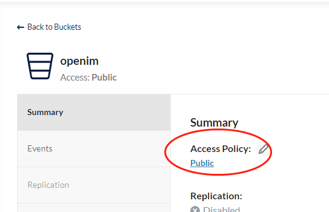

# minio快速部署/使用文档


## 1.部署minio(unix)
- docker单机模式部署
```
    docker run -d -p 9000:9000 -p 9090:9090 --name minio \
      -e "MINIO_ROOT_USER={{YOUR_ACCESS_KEY}}" \
      -e "MINIO_ROOT_PASSWORD={{YOUR_SECRET_KEY}}" \
      -v /mnt/data:/data \
      -v /mnt/config:/root/.minio \
      minio/minio server /data --console-address ':9090'
```
- 将-e docker 容器内环境变量MINIO_ROOT_USER和MINIO_ROOT_PASSWORD的值即{{YOUR_ACCESS_KEY}}和{{YOUR_SECRET_KEY}}替换成自己定义的值，用以登录管理后台和生成临时密钥。
- 9000 端口即minio API的端口，9090端口为minio web管理端的端口，docker容器内环境变量MINIO_ROOT_USER为web管理端的登录账户，环境变量MINIO_ROOT_PASSWORD为登录密码。
- --console-address 即docker内部web管理系统端口，可不做修改。

- docker集群部署
四台机器
``` 
    # 192.168.1.1
    docker run -d -p 10010:9000 -p 10011:9090 --name minio_cluster \
         -e "MINIO_ROOT_USER={{YOUR_ACCESS_KEY}}" \
         -e "MINIO_ROOT_PASSWORD={{YOUR_SECRET_KEY}}" \
         -v /mnt/data:/data \
         -v /mnt/config:/root/.minio \
         minio/minio server \
         http://192.168.1.1/data \
         http://192.168.1.2/data \
         http://192.168.1.3/data \
         http://192.168.1.4/data \
         --console-address ':9090'
    
    docker run -d -p 10010:9000 -p 10011:9090 --name minio_cluster1 \
             -e "MINIO_ROOT_USER={{YOUR_ACCESS_KEY}}" \
             -e "MINIO_ROOT_PASSWORD={{YOUR_SECRET_KEY}}" \
             -v /mnt/data1:/data \
             -v /mnt/config1:/root/.minio \
             minio/minio server \
             http://127.0.0.1/data1 \
             http://192.168.1.2/data2 \
             http://192.168.1.3/data3 \
             http://192.168.1.4/data4 \
             --console-address ':9090'
    docker run -d -p 10020:9000 -p 10021:9090 --name minio_cluster2 \
                 -e "MINIO_ROOT_USER={{YOUR_ACCESS_KEY}}" \
                 -e "MINIO_ROOT_PASSWORD={{YOUR_SECRET_KEY}}" \
                 -v /mnt/data:/data \
                 -v /mnt/config:/root/.minio \
                 minio/minio server \
                 http://192.168.1.1/data \
                 http://192.168.1.2/data \
                 http://192.168.1.3/data \
                 http://192.168.1.4/data \
                 --console-address ':9090'
    
```

##### 2.查看minio启动状况
- 执行docker ps命令
  
  代表minio和minio的web管理端启动成功 容器内部9000映射到主机9000，9090映射到9090。

##### 3.更改服务端配置文件config/config.yaml和更改sdk初始化的IMConfig
- 将config.yaml里minio字段accessKeyID更换为刚刚docker启动填写的MINIO_ROOT_USER即{{YOUR_ACCESS_KEY}}，将MINIO_ROOT_PASSWORD更换为{{YOUR_SECRET_KEY}},
  bucket即存储桶名，将endpoint改为minio的ip地址，端口为9000，如http://41.42.441.144:9000，
  因为客户端上传文件直接调用minio的API，服务端调用minio的API做初始化桶的操作， 所以注意这个ip地址需要是IM服务端和客户端都能访问到的。
- sdk初始化将配置里ObjectStorage参数改为'minio',

##### 4.重启(启动)服务端和SDK
- 重启服务端的目的在于加载第二步新填写的config.yaml minio配置，并且服务端初始化时自动检测创建minio存储桶。
- 重启sdk的目的在于生效更改的objectStorage参数


##### 5.进入minio Web端更改存储桶权限
- 在浏览器进入9090端口的web管理端 进入web端将存储桶权限修改为public后即可使用minio。
### 1 进入桶

### 2 更改权限为public
