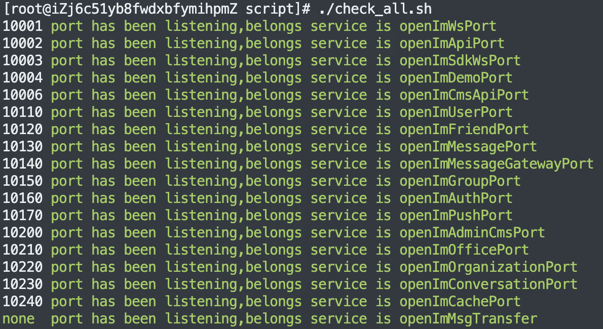

## docker部署常见问题总结分析和解决办法

### 1.环境及内存问题

Linux系统 2G及以上可用内存 ，其他操作系统还没经过测试。

### 2.mongodb启动失败

由于mongodb新老版本数据格式不兼容导致，清除mongodb数据，并重启

```
docker-compose down
rm components/mongodb/data/ -rf
docker-compose up -d
```

### 3.外部已有mongo，mysql等组件

```
docker-compose down
```

先注释掉docker-compose.yaml中 open_im_server对应的depends_on；修改config/config.yaml对于的组件信息，ip port用户 密码等等；

```
docker-compose up -d
```


#### 4.start_all.sh显示open_im_sdk_server SERVICE START ERROR PLEASE CHECK openIM.log

>建议排查思路：1.确保IM.log如果没有显示任何错误
解决方法：
```
1.使用Supervisor管理器挂载编译后的/bin/open_im_sdk_server可执行文件
2.重新执行./check_all.sh
```


#### 5.check_all.sh显示有服务失败，docker-compose ps显示某些服务不处于Up状态

>建议排查思路：1.如果连续执行check_all.sh都有失败，如果发现mongo的State处于Restaring状态，说明mongo运行不正常（由于版本问题导致）

解决方法：

```
1.docker-compose down
2.进入项目的目录的components/下，删除mongo的文件夹（正式线上保持一种版本，可以修改docker-compose中的mongo镜像版本）
3.检查docker images下所有镜像的版本，可以用docker rmi [IMAGE ID]删除老的镜像，比如：open_im_server和mongo的镜像
4.docker-compose up -d
```


#### 6.check_all.sh显示有服务失败，docker-compose ps显示所有组件up正常，查看IM.log

>建议排查思路：1.如果IM.log中有mysql.go或者model.go的错误，一般情况是mysql初始化失败（部署环境中如果已经有MySQL的情况）

解决方法：

```
1.这种情况通过lsof -i:3306查看MySQL是否正常启动
2.进入config/config.yaml文件中修改mysql的用户和密码(已有MySQL的用户和密码)，或者关闭外部的MySQL
3.docker-compose retart 重启服务
```

>建议排查思路：2.如果IM.log中有mysql.go或者model.go的错误，一般情况是mysql初始化失败（全新系统，外部并没有安装过MySQL）

解决方法：

```
1.官方建议，混合启动，保持所有组件运行正常
2.安装go语言环境：wget -c https://dl.google.com/go/go1.17.linux-amd64.tar.gz -O - | sudo tar -xz -C /usr/local
3.进入项目script中执行chmod +x *.sh
4.执行./build_all_service.sh
5.执行./start_all.sh
6.执行./check_all.sh
```

正常情况如下：




