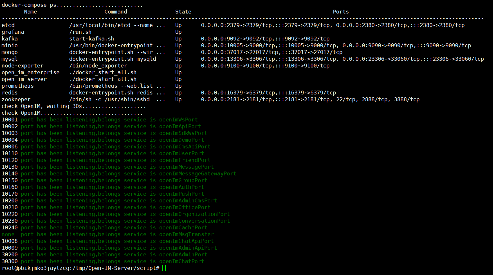

## （一）服务端快速部署

（1）仅限于用户第一次初始化安装；

（2）仅限于服务端有外网ip的情况，对于在内网部署或者需要nginx反代的情况，需要参考[此链接](https://doc.im.cn/#/v2/server_deploy/easy_deploy_new)；

（3）仅针对未安装过mysql etcd kafka mongodb redis组件的服务器；

（4）特别关注是否有warning输出；

1. 项目clone

```
git clone http://47.243.225.90:3000/im/im-server.git; 账号密码：找管理员索取
```

2. 初始化安装

```
cd  im-server; chmod +x install_im_server.sh; ./install_im_server.sh;
```

3. 检查服务

```
cd script;./docker_check_service.sh
```

如果有失败提示，再执行一次



4. 开放端口

   | IM端口    | 说明                                                    | 访问说明                           |
   | --------- | ------------------------------------------------------- | ---------------------------------- |
   | TCP:10001 | IM ws消息                                               | 在域名和路由之间增加msg_gateway    |
   | TCP:10002 | IM api                                                  | 在域名和路由之间增加api            |
   | TCP:10003 | ws端口 老版本jssdk的专用，基本废弃，jssdk建议用wasm版本 | 在域名和路由之间增加jssdk_gateway  |
   | TCP:10004 | demo注册登录，已经废弃                                  | 在域名和路由之间增加demo           |
   | TCP:10005 | minio存储                                               |                                    |
   | TCP:10006 | IM 后台管理                                             | 在域名和路由之间增加admin          |

## （二）app验证

[下载app验证](https://doc.im.cn/#/v2/validation/app)

双击修改ip，保存配置，重启app。千万不要修改端口

## （三）web/pc验证

web仅限于外网验证[web验证](https://doc.im.cn/#/js_v2/sdk_integrate/development?id=%e5%9c%a8%e7%ba%bf%e6%b5%8b%e8%af%95)

如果纯内网环境建议用[pc应用验证](https://doc.im.cn/#/js_v2/sdk_integrate/development?id=electron%e5%ba%94%e7%94%a8%e4%b8%8b%e8%bd%bd)
